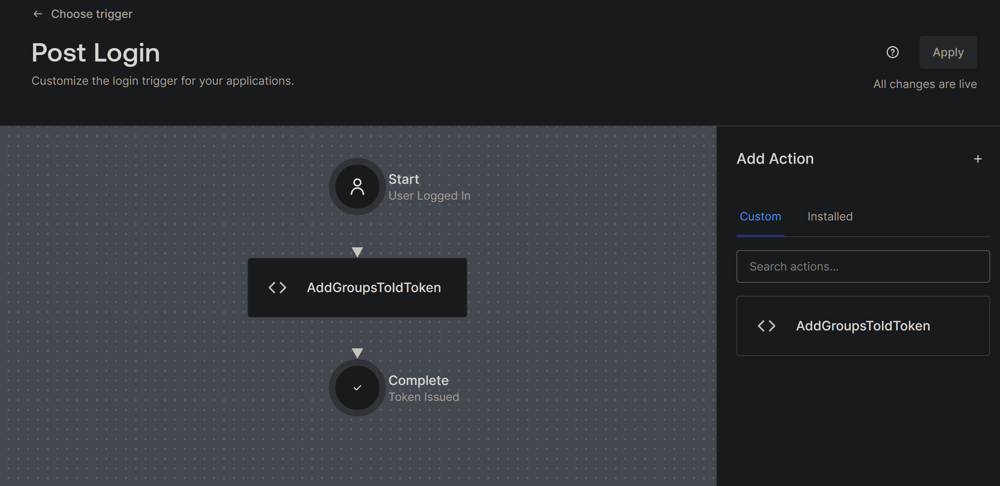
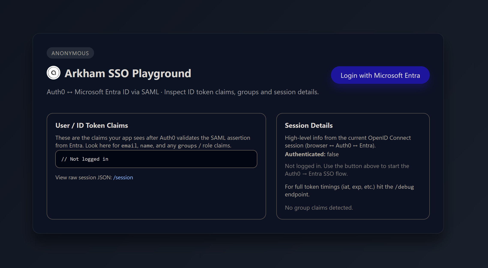
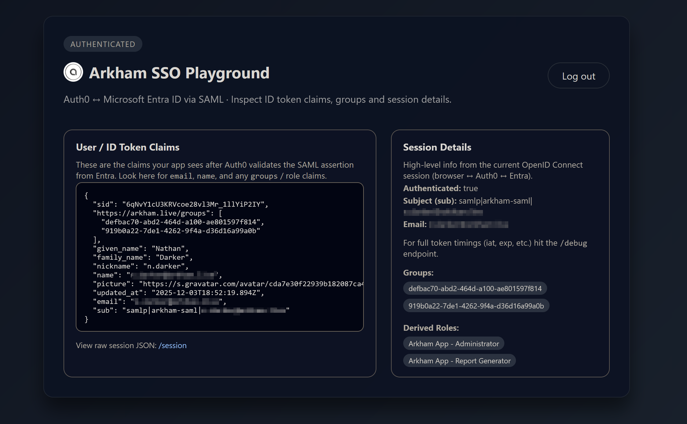

# Arkham SSO Playground

A lightweight, clear, and practical **SAML → Auth0 → OIDC** authentication playground created to deepen understanding of how SAML-based SSO works behind the scenes.

## Purpose of This Project

This application was originally generated with the assistance of **OpenAI Codex**, and then further extended, refined, and customised to support a complete end‑to‑end SAML → Auth0 → OIDC learning environment. Codex provided the initial scaffolding, routing structure, and basic authentication integration, while the remaining logic, identity configuration, UI enhancements, and group/role modelling were developed manually to support deeper learning.

This application was created after recognising that I was configuring SAML authentication flows in my day job, without fully understanding the end‑to‑end mechanics. While it was possible to set up SAML SSO in Azure and Auth0 by following established patterns, the internal workings of the flow—SAML assertions, mappings, transformations, and claim propagation, remained unclear.

To address this, the following components were configured from scratch:

* The Azure Enterprise Application.
* The SAML configuration and group claim emission.
* The Auth0 SAML connection and claim mappings.
* The Auth0 Action enriching the ID token.

The goal is to provide a practical, observable environment that shows every step of the process, making the SAML → Auth0 → OIDC flow fully transparent and easier to reason about.

A lightweight, clear, and practical **SAML → Auth0 → OIDC** authentication playground designed to help you understand how enterprise SSO flows work between:

* Microsoft Entra ID (Azure AD).
* Auth0 (acting as the SAML Service Provider / federation broker).
* A Node.js Web App (OIDC Relying Party).

This project allows you to:

* Perform real Microsoft Entra authentication via SAML.
* Inspect the raw ID token Auth0 issues after processing the SAML assertion.
* View Azure group GUID claims inside the token.
* See derived application roles based on group membership.
* Understand SAML → Auth0 → OIDC claim transformation.
* Explore Auth0 Actions for token enrichment.

## Features

### Microsoft Entra ID (Azure AD) → Auth0 SAML Login

Real authentication against your Azure tenant using SAML 2.0.

### Auth0 → OIDC ID Token Processing

Auth0 consumes the SAML assertion and issues a standards‑compliant OIDC ID token.

### Claim Inspector

At runtime you can view:

* `email`, `given_name`, `family_name`
* Azure `groups` claim (GUIDs)
* Session metadata (`iat`, `exp`, `sid`)

### Role Mapping

Azure group GUIDs are mapped to application roles such as:

* Administrator
* Developer
* Viewer
* Support Agent
* Report Generator

These roles correspond to the group mapping defined in `app.js`:

```bash
const GROUP_ROLE_MAP = {
  "<GROUP_ID>": "Arkham App - Administrator",
  "<GROUP_ID>": "Arkham App - Developer",
  "<GROUP_ID>": "Arkham App - Report Generator",
  "<GROUP_ID>": "Arkham App - Support Agent",
  "<GROUP_ID>": "Arkham App - Viewer"
};
```

You are free to create and use your own Azure groups, however, you will need to ensure that the Azure Enterprise Application have **these exact groups** assigned to the application. Their GUIDs and names **must match** the values defined in `app.js` as above.

## Project Structure

```bash
arkham-sso-playground/
├── app.js
├── package.json
├── package-lock.json
├── images/
├── .env
└── .gitignore
```

## Installation

Clone this repository:

```bash
git clone https://github.com/aut0nate/arkham-sso-playground.git
cd arkham-sso-playground
```

Install dependencies:

```bash
npm install
```

## Configure Your Environment

Create a local `.env` (this file is ignored by Git):

```bash
cp .env.template .env
```

Then edit `.env` with your values:

```bash
ISSUER_BASE_URL=https://YOUR_DOMAIN_REGION.auth0.com
BASE_URL=http://localhost:3000
CLIENT_ID=YOUR_AUTH0_CLIENT_ID
SESSION_SECRET=YOUR_AUTH0_SECRET
```

The above values excluding (BASE_URL) must be obtained from Auth0 upon creating your Auth0 application, see Auth0 Configuration below.

## Auth0 Configuration

This section describes how to create the Auth0 Application and the SAML Enterprise Connection required for this project.

### 1. Create an Auth0 Application (OIDC Relying Party)

1. In Auth0 Dashboard, go to **Applications → Applications**.
2. Click **Create Application**.
3. Name it "arkham-web".
4. Choose **Regular Web Application**.
5. After creation, configure:

   - **Allowed Callback URLs:**

     ```bash
     http://localhost:3000/callback
     ```

   - **Allowed Logout URLs:**

     ```bash
     http://localhost:3000/SignedOut
     ```

6. Copy the following values into your local `.env`:

- **ISSUER_BASE_URL** (your Auth0 domain).
- **CLIENT_ID** (your Auth0 application client id).
- **SESSION_SECRET** (your Auth0 application secret).

### 2. Create the SAML Enterprise Connection in Auth0

1. Navigate to **Authentication → Enterprise → SAML**.
2. Click **Create Connection**.
3. Name it "arkham-web".
4. Under **Settings**, configure:

   - **Sign-In URL** → obtained from Azure (see Azure Entra Configuration below).
   - **Signing Certificate (Base64 CER)** →obtained from Azure (see Azure Entra Configuration below).

5. Under **Application Assignments**, ensure your newly created application is enabled.

## Azure Entra Configuration (Enterprise Application)

This section describes the full process for configuring an Azure Enterprise Application.

### 1. Create the Enterprise Application

In Azure:

1. Go to **Microsoft Entra ID**.
2. Select **Enterprise Applications**.
3. Click **New application**.
4. Choose **Create your own application**.
5. Choose **Integrate any other application you don't find…**.
6. Name it "Arkham Web (Auth0)".

### 2. Enable SAML-based Sign‑on

1. Under **Manage**, select **Single sign-on**.
2. Choose **SAML**.
3. Configure:

   - **Identifier (Entity ID):**

     ```bash
     urn:auth0:YOURTENANT:arkham-web
     ```

   - **Reply URL:**

     ```bash
     https://YOUR_AUTH0_DOMAIN/login/callback?connection=arkham-web
     ```

### 3. Create Application Groups in Azure

Create your security groups in Azure, for example:

- Arkham - Change Approvers
- Arkham App - Administrator
- Arkham App - Developer
- Arkham App - Report Generator
- Arkham App - Support Agent
- Arkham App - Viewer

Assign these groups to the Enterprise Application under:

Enterprise Application → Users and Groups → Add User/Group.

### 4. Configure the SAML Group Claim

In the Enterprise Application:

1. Go to **Single Sign-On**.
2. Click **Edit** on **Attribute and Claims**.
3. Click **Add a Group Claim**.
4. Choose **Groups assigned to the application**.
5. Choose **Group ID** as the **Source Attribute**.
6. Click Save.

Azure will now emit:

```bash
http://schemas.microsoft.com/ws/2008/06/identity/claims/groups
```

### 5. Configure Auth0 to Map the SAML Group Claim

In Auth0:

1. Go to **Authentication → Enterprise → SAML → arkham-change-app**.
2. Open **Mappings**.
3. Add:

```json
"groups": "http://schemas.microsoft.com/ws/2008/06/identity/claims/groups"
```

This maps Azure's SAML group IDs into the Auth0 user profile.

### 6. Add Group Claims to the ID Token (Auth0 Action)

In Auth0:

1. Go to **Actions → Triggers → Post Login**.
2. Click **Add Action → Create a Custom Action**.
3. Provide the following information:

   - **Name:** AddGroupsToIDToken.
   - **Trigger:** Login/Post Login.
   - **Runtime:** Node 22.

4. Click **Create**.
5. Remove any code in the code block and paste the following:

    ```js
    exports.onExecutePostLogin = async (event, api) => {
    const groups = event.user.groups;
    if (groups) {
        const groupsArray = Array.isArray(groups)
        ? groups
        : String(groups).split(',');
        api.idToken.setCustomClaim("https://arkham.live/groups", groupsArray);
    }
    };
    ```

6. Click **Deploy**.
7. Add this Action to your **Login Flow**:



## Running the App

```bash
npm start
```

Visit:

```bash
http://localhost:3000
```

Use **"Login with Microsoft Entra"** to start the SAML → Auth0 → OIDC flow.

## Screenshots

### Before Login



### After Login (Authenticated State)



## Testing

### `/session`

Shows the current user session and ID token claims.

### `/debug`

Displays raw token payloads and timing information.

## License

This project is licensed under the MIT License. See [LICENSE](./LICENSE) for details.
